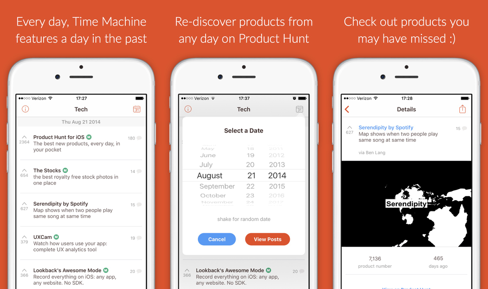

#

Time Machine brings you back to the future of Product Hunt so you can re-discover the best new products again (or for the first time).

## Links

* [App Store](https://itunes.apple.com/us/app/product-hunt-time-machine/id956311358)
* [Website](http://thomasmeagher.com/ProductHuntTimeMachine/)
* [Product Hunt](http://www.producthunt.com/posts/product-hunt-timemachine)

## Props
Some of the awesome products I used to build Time Machine:

* [App Screenshot Builder](https://launchkit.io/screenshots)
* [Make App Icon](http://makeappicon.com/)
* [Product Hunt API](https://api.producthunt.com/v1/docs)
* [Sketch 3](http://bohemiancoding.com/sketch/)
* [Swift](https://developer.apple.com/swift/)
* [The Noun Project](https://thenounproject.com/)

## License

Time Machine is released under the MIT license. See LICENSE for details.